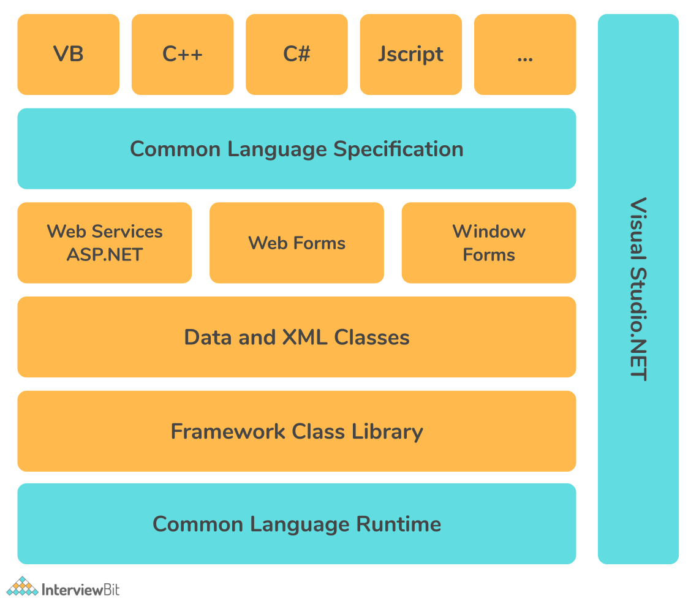
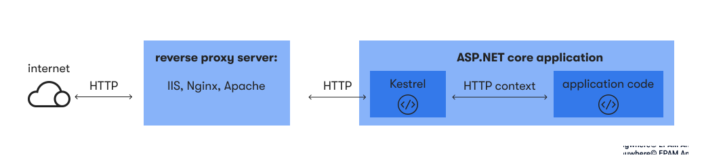

# Description 
.NET is a free, cross-platform, open-source developer platform for building many kinds of applications. It can run programs written in multiple languages, with C# being the most popular. It relies on a high-performance runtime that is used in production by many high-scale apps.

Here are some of the key features of .NET and the possible interview questions from them

# Table of contents
1. [Introduction](#introduction)
    1. [Intro to C#](#introtocsharp)
2. [Oops conecpt using dotnet](#oppsindotnet)
3. [Compailer Basic](#intro-to-compiler)
    1. [Advance concepts in compiler](#advance-concepts-in-compiler)
    2. [Good to know stuff from compiler(optional)](#complex-questions-of-compiler)
    3. [Mejor Components in Dotnet Framework(optional)](#major-components-of-the-dotnet-framework)
4. [Asp Net MVC ](#asp-net-mvc)
5. [Asp Net Core](#asp-net-core)
    1. [Advance concept in dotnet core](#advance-dotnetcore)
6. [Sql Server with dotnet](./SqlServer_questions.md)
7. [Basic Good to know docker questions](./Basic_Docker_Questions.md)

8. [Basic Concept of GIT](./Basic_git.md)
9. [Basic of Azure](./Basic_azure.md)

# Introduction to dotnet <a id="introduction"></a>
1. **What is .NET Framework, .NET Core, and .NET Standard?**
   
   - **Answer:** 
     - .NET Framework: A software development framework for building Windows applications.
     - .NET Core: An open-source, cross-platform framework for building modern, cloud-based, and internet-connected applications.
     - .NET Standard: A formal specification of .NET APIs that are common across all .NET implementations.

2. **Differentiate between ASP.NET Core and ASP.NET Framework.**
   
   - **Answer:** 
     - ASP.NET Core: Open-source, cross-platform framework for building modern, cloud-based, and internet-connected applications. It's highly modular, lightweight, and supports Docker.
     - ASP.NET Framework: The traditional Windows-only framework for building web applications. It's tightly integrated with Windows and IIS.

3. **What are the key advantages of using ASP.NET Core over ASP.NET Framework?**
   
   - **Answer:**
     - Cross-platform support.
     - High-performance server and client-side performance.
     - Built-in dependency injection.
     - Modular design with middleware pipeline.
     - Support for modern web development practices like SPA and microservices.

4. **Explain Dependency Injection in ASP.NET Core.**
   
   - **Answer:**
     - Dependency Injection (DI) is a design pattern used to create loosely coupled components in software applications.
     - In ASP.NET Core, DI is built into the framework, allowing developers to inject dependencies into controllers, views, and other components.
     - It improves maintainability, testability, and scalability of applications.

5. **What is Middleware in ASP.NET Core?**
   
   - **Answer:**
     - Middleware is software components that are assembled into the application pipeline to handle requests and responses.
     - In ASP.NET Core, middleware can perform tasks like authentication, logging, error handling, and more.
     - Middleware is configured in the `Startup.cs` file using the `Use` methods.

6. **Explain the concept of .NET Standard and its significance.**
   
   - **Answer:**
     - .NET Standard is a formal specification of .NET APIs that are intended to be available on all .NET implementations.
     - It allows libraries and frameworks to target a common set of APIs, making them compatible with multiple .NET platforms such as .NET Framework, .NET Core, Xamarin, etc.
     - .NET Standard simplifies code sharing and interoperability across different .NET implementations.

7. **What is the purpose of Globalization and Localization in ASP.NET Core?**
   
   - **Answer:**
     - Globalization is the process of designing and developing applications that support multiple cultures and languages.
     - Localization is the process of adapting an application to a specific culture and language.
     - In ASP.NET Core, globalization and localization are achieved using resource files, culture-specific formatting, and localization middleware.

8. **What are Razor Pages in ASP.NET Core?**
   
   - **Answer:**
     - Razor Pages is a page-based programming model in ASP.NET Core for building web UI.
     - It combines the benefits of MVC and Web Forms, offering a simpler syntax for building dynamic web pages.
     - Razor Pages encourage a more organized and cohesive approach to web development by keeping related code and markup together.

9. **Explain the process of deploying an ASP.NET Core application.**
   
   - **Answer:**
     - Compile the application for the target platform using `dotnet publish`.
     - Copy the published output to the deployment server.
     - Install any required runtime dependencies on the server.
     - Configure the web server (e.g., IIS, Nginx, Apache) to host the application.
     - Start the web server and verify that the application is accessible.

10. **What is Entity Framework Core? How does it differ from Entity Framework in ASP.NET Framework?**
    
    - **Answer:**
      - Entity Framework Core is a lightweight, extensible, and cross-platform version of Entity Framework for .NET Core applications.
      - It provides support for a wider range of database providers and has improved performance compared to Entity Framework.
      - Entity Framework in ASP.NET Framework is tightly integrated with Windows and primarily targets SQL Server, while Entity Framework Core is more flexible and supports multiple database providers.

11. **What is boxing and unboxing in .NET?**
    - **Answer:**
        - Boxing is the process of converting a value type into a reference type directly. Boxing is implicit.

        - Unboxing is the process where reference type is converted back into a value type. Unboxing is explicit.

        An example is given below to demonstrate boxing and unboxing operations:

        ```csharp
        int a = 10;      // a value type
        object o = a;     // boxing
        int b = (int)o;   // unboxing
        ```
12. **What is MIME in .NET?**
    - **Answer**
        MIME stands for Multipurpose Internet Mail Extensions. It is the extension of the e-mail protocol which lets users use the protocol to exchange files over emails easily.

        Servers insert the MIME header at the beginning of the web transmission to denote that it is a MIME transaction.

        Then the clients use this header to select an appropriate ‘player’ for the type of data that the header indicates. Some of these players are built into the web browser.

13. **Explain different types of cookies available in ASP.NET?**
    - **Answer:**
    Two types of cookies are available in ASP.NET. They are:

        - Session Cookie: It resides on the client machine for a single session and is valid until the user logs out.
        - Persistent Cookie: It resides on the user machine for a period specified for its expiry. It may be an hour, a day, a month, or never.

14. **What is the meaning of CAS in .NET?**
    - **Answer:**
        - Code Access Security(CAS) is necessary to prevent unauthorized access to programs and resources in the runtime. It is designed to solve the issues faced when obtaining code from external sources, which may contain bugs and vulnerabilities that make the user’s system vulnerable.

        CAS gives limited access to code to perform only certain operations instead of providing all at a given point in time. CAS constructs a part of the native .NET security architecture.

15. **What is the appSettings section in the web.config file?**
    We can use the appSettings block in the web.config file, if we want to set the user-defined values for the whole application. Example code given below will make use of ConnectionString for the database connection throughout the project:
    ```xml
    <em>
    <configuration>
        <appSettings>
            <add key= "ConnectionString" value="server=local; pwd=password; database=default"  />
        </appSettings>
    </configuration>
    </em>
    ```
16. **What are the types of memories supported in the .NET framework?**
    Two types of memories are present in .NET. They are:

    - Stack: Stack is a stored-value type that keeps track of each executing thread and its location. It is used for static memory allocation.

    - Heap: Heap is a stored reference type that keeps track of the more precise objects or data. It is used for dynamic memory allocation.

17. **Explain localization and globalization.**
    - Localization is the process of customizing our application to behave as per the current culture and locale.

    - Globalization is the process of designing the application so that it can be used by users from across the globe by supporting multiple languages.


##  Intro to C# <a id="introtocsharp"></a>
1. **What is the difference between IEnumerable and IQueryable interfaces in C#? When would you use each one?**
    - IEnumerable is used for querying in-memory collections, while IQueryable is used for querying external data sources, like databases. IQueryable allows you to write and execute more complex queries on the server.
2. **What are the differences between async/await and Task.Run in C# when dealing with asynchronous code?**
    - Async/await is used to create asynchronous methods that can be awaited without blocking the main thread. Task.Run is used to execute a delegate or lambda expression on a ThreadPool thread asynchronously. It can be helpful to offload CPU-bound work from the main thread.
3. **How do you implement a custom exception handling middleware in ASP.NET Core?**
    Here’s a summary of the process:

    Implement a custom middleware that handles exceptions.

    Use app.UseMiddleware to add the middleware to the application’s request pipeline.

    In the middleware, catch exceptions, log them, and return an appropriate response.
4. **What is the difference between int and Int32?**
    - There is no difference between int and Int32. Int32 is a type provided by the .NET framework class whereas int is an alias name for Int32 in the C# programming language.

5.  **Explain the differences between value type and reference type.**
    The main differences between value type and reference type are given below:

    - A Value Type holds the actual data directly within the memory location and a reference type contains a pointer which consists of the address of another memory location that holds the actual data.
    - Value type stores its contents on the stack memory and reference type stores its contents on the heap memory.
    - Assigning a value type variable to another variable will copy the value directly and assigning a reference variable to another doesn’t copy the value, instead, it creates a second copy of the reference.
    - Predefined data types, structures, enums are examples of value types. Classes, Objects, Arrays, Indexers, Interfaces, etc are examples of reference types.

6. **Explain the differences between covariance and contravariance in C# for delegates and interfaces.**
    Covariance allows using a more derived type instead of a less derived type, while contravariance enables the opposite. In C#, covariance can be applied to interfaces using the out keyword, and contravariance can be applied using the in keyword.

7. **How do you handle deadlocks in multi-threaded C# applications?**
    - Deadlocks occur when multiple threads are blocked, waiting for each other to release resources. To handle deadlocks, follow best practices like acquiring locks in a consistent order, using timeout mechanisms, and avoiding long-running locks.

8. **How can you improve string concatenation performance in C#?**
    - Use StringBuilder instead of repeated string concatenation with + to improve performance, especially when concatenating or linking multiple strings together in a loop.

9. **Explain the differences between a deep copy and a shallow copy of objects in C#. How can you perform each type of copy?**
    - A shallow copy creates a new object but doesn’t duplicate internal references. A deep copy creates a new object and clones all internal references recursively. Shallow copying can be done using MemberwiseClone, while deep copying requires custom implementation.

10. **What is a Singleton design pattern?**
    - The singleton pattern ensures that a class has only one instance and provides a global point of access to that instance. It typically involves a private constructor and a static method to retrieve the instance.

11. **What is the difference between an abstract class and an interface?**
    The main difference between an abstract class and an interface are listed below:

    |Abstract Class|	Interface|
    |--------------|-------------|
    |Used to declare properties, events, methods, and fields as well.|	Fields cannot be declared using interfaces.|
    |Provides the partial implementation of functionalities that must be implemented by inheriting classes.|	Used to declare the behavior of an implementing class.|
    |Different kinds of access modifiers like private, public, protected, etc. are supported.|	Only public access modifier is supported.|
    |It can contain static members.|	It does not contain static members.|
    |Multiple inheritances cannot be achieved.|	Multiple inheritances are achieved.|


# OOPs concept in dotnet <a id="oppsindotnet"></a>
1. **What are the four fundamental principles of Object-Oriented Programming?**
   - The four fundamental principles of OOP are:
     - Encapsulation: Bundling of data and methods that operate on that data into a single unit (class).
     - Inheritance: Ability of a class to inherit properties and behaviors from another class.
     - Polymorphism: Ability to present the same interface for different data types or objects.
     - Abstraction: Process of hiding the complex implementation details and showing only the necessary features of an object.

2. **Explain the concept of Inheritance in C#. How is it implemented in .NET?**
   - Inheritance is a mechanism in which a new class (derived or child class) is created from an existing class (base or parent class), acquiring its properties and behaviors.
   - In .NET, inheritance is implemented using the `:` symbol after the derived class name followed by the base class name. For example: `class DerivedClass : BaseClass`.

3. **What is the difference between abstract classes and interfaces in C#?**
   - Abstract classes:
     - Can contain both abstract and non-abstract (concrete) methods.
     - Cannot be instantiated directly; they need to be inherited.
     - Can have fields, constructors, properties, and methods.
   - Interfaces:
     - Can only contain method signatures, properties, events, and indexers (no implementation).
     - Cannot have fields, constructors, or concrete methods.
     - Provide a contract for classes to implement.

4. **What is Polymorphism in C#? How can it be achieved using method overriding and method overloading?**
   - Polymorphism allows objects of different types to be treated as objects of a common superclass. It can be achieved in C# using method overriding and method overloading.
   - Method Overriding: Defining a method in a derived class that has the same signature as a method in the base class, thus replacing the base class implementation with a new one.
   - Method Overloading: Defining multiple methods in the same class with the same name but different signatures (parameters).

5. **What is Encapsulation? How does it help in achieving data hiding in C#?**
   - Encapsulation is the bundling of data and methods that operate on that data into a single unit (class). It helps in achieving data hiding by restricting access to certain components of the object from outside the class, thus preventing unauthorized access and modification of data.

6. **Explain the purpose of access modifiers in C#. Provide examples of public, private, protected, and internal access modifiers.**
   - Access modifiers control the accessibility of classes, methods, and other members in C#.
     - Public: Accessible from any other class or assembly.
     - Private: Accessible only within the same class.
     - Protected: Accessible within the same class or derived classes.
     - Internal: Accessible within the same assembly.

7. **What are constructors in C#? Differentiate between a default constructor and a parameterized constructor.**
   - Constructors are special methods in a class that are used to initialize objects of that class. 
     - Default Constructor: Constructor with no parameters. It's automatically provided by the compiler if no constructors are defined explicitly.
     - Parameterized Constructor: Constructor with parameters used to initialize the object with specific values.

8. **What is the purpose of the 'base' keyword in C#? How is it used in constructor chaining and method overriding?**
   - The 'base' keyword in C# is used to access members of the base class from within a derived class.
   - In constructor chaining, 'base' is used to invoke the constructor of the base class from the constructor of the derived class.
   - In method overriding, 'base' is used to call the base class implementation of a method from within the overridden method in the derived class.

9. **Explain the concept of interfaces in C#. How are they different from abstract classes, and when would you prefer using one over the other?**
   - Interfaces define a contract for classes to implement by specifying method signatures, properties, events, and indexers.
   - Interfaces cannot contain implementation details, while abstract classes can.
   - Use interfaces when you want to provide a contract for multiple unrelated classes to implement, and use abstract classes when you want to share common behavior among related classes.

10. **What is the significance of the 'sealed' keyword in C#? Provide a scenario where you might use it.**
    - The 'sealed' keyword in C# is used to prevent inheritance of a class or overriding of a method.
    - You might use 'sealed' when you want to prevent further derivation of a class to ensure that its behavior remains unchanged and to optimize performance.

11. **What is method hiding in C#? How does it differ from method overriding?**
    - Method hiding is a technique in which a method in a derived class hides the implementation of a method with the same name and signature in the base class.
    - Method hiding is achieved by using the 'new' keyword in the derived class.
    - Method overriding, on the other hand, replaces the base class implementation with a new implementation in the derived class, allowing polymorphic behavior.

12. **What are static classes and static members in C#? When would you use them?**
    - Static classes and members belong to the type itself rather than to any specific instance of the type.
    - Static classes cannot be instantiated and are sealed by default.
    - Static members are shared across all instances of the type.
    - Use static classes and members when you want to create utility methods, constants, or properties that are not tied to a specific instance of the class.

13. **What is the purpose of the 'this' keyword in C#? Provide examples of its usage.**
    - The 'this' keyword in C# is used to refer to the current instance of the class.
    - It can be used to differentiate between instance variables and parameters with the same name, to pass the current object as a parameter to other methods, and to access instance members within constructors.

14. **Explain the concept of namespaces in C#. How do they help in organizing code?**
    - Namespaces in C# are used to organize code into logical groups and prevent naming conflicts.
    - They provide a way to encapsulate related classes, interfaces, enums, and other types within a hierarchical structure.
    - Namespaces help in improving code readability, maintainability, and reusability by providing a clear structure to the codebase.

15. **What is garbage collection in .NET? How does it help in managing memory?**
    - Garbage collection in .NET is a process by which the runtime automatically deallocates memory that is no longer in use by the application.
    - It helps in managing memory by identifying and releasing objects that are no longer reachable or referenced by the application, thus preventing memory leaks and improving performance.


# Intro to compiler <a id="intro-to-compiler"></a>
Lets discuss the compiler first how it works. 

- .NET framework-based applications that are written in supportive languages like C#, F#, or Visual basic are compiled to Common Intermediate Language (CIL).
- Compiled code is stored in the form of an assembly file that has a .dll or .exe file extension.
- When the .NET application runs, Common Language  Runtime (CLR) takes the assembly file and converts the CIL into machine code with the help of the Just In Time(JIT) compiler.
- Now, this machine code can execute on the specific architecture of the computer it is running on.


1. **What is the role of the .NET Compiler?**
   
   - **Answer:** 
     - The .NET Compiler translates source code written in languages such as C#, Visual Basic, or F# into Intermediate Language (IL) code, also known as MSIL (Microsoft Intermediate Language) or CIL (Common Intermediate Language).
     - The IL code is then further compiled by the .NET Just-In-Time (JIT) compiler into machine code that can be executed by the target platform.

2. **Explain the difference between the C# Compiler (csc.exe) and the JIT Compiler.**
   
   - **Answer:** 
     - The C# Compiler (csc.exe) is responsible for translating C# source code into Intermediate Language (IL) code.
     - The JIT (Just-In-Time) Compiler, on the other hand, translates IL code into native machine code at runtime, just before it is executed by the CPU.
     - While the C# Compiler runs during development to produce IL code, the JIT Compiler runs at runtime to produce native machine code optimized for the specific hardware architecture.

3. **What is Ahead-Of-Time (AOT) Compilation in .NET?**
   
   - **Answer:** 
     - Ahead-Of-Time (AOT) Compilation is a process where the IL code is compiled into native machine code ahead of execution, typically during the deployment or installation phase.
     - This eliminates the need for JIT compilation at runtime, resulting in faster startup times and improved performance, especially in scenarios where JIT overhead is significant.
     - AOT compilation is commonly used in scenarios such as Xamarin mobile app development or .NET Native applications.

4. **Explain the concept of Just-In-Time (JIT) Compilation in .NET.**
   
   - **Answer:** 
     - Just-In-Time (JIT) Compilation is a technique where the Intermediate Language (IL) code is compiled into native machine code at runtime, just before it is executed by the CPU.
     - The JIT Compiler optimizes the IL code based on the runtime environment, hardware architecture, and usage patterns of the application.
     - JIT compilation allows .NET applications to be platform-independent since the native machine code is generated dynamically based on the execution environment.

5. **What are the benefits of JIT Compilation in .NET?**
   
   - **Answer:** 
     - Platform independence: .NET applications can run on any platform that supports the .NET runtime, as the native machine code is generated dynamically at runtime.
     - Optimization: JIT compilation allows for runtime optimizations tailored to the specific hardware architecture and runtime environment, leading to improved performance.
     - Reduced memory footprint: JIT compilation eliminates the need to store pre-compiled binaries for multiple target platforms, reducing the overall memory footprint of the application.

6. **How does the .NET Compiler optimize the IL code?**
   
   - **Answer:** 
     - The .NET Compiler performs various optimizations on the IL code to improve performance and reduce resource consumption.
     - Common optimization techniques include dead code elimination, inline expansion, constant folding, loop unrolling, and register allocation.
     - Additionally, the JIT Compiler applies runtime optimizations based on the execution profile of the application, such as method inlining and code specialization.

7. **What is Roslyn in the context of .NET Compiler Platform?**
   
   - **Answer:** 
     - Roslyn is the codename for the .NET Compiler Platform, which provides a set of APIs and tools for building custom code analysis, refactoring, and code generation tools for C# and Visual Basic.
     - Roslyn includes the C# and Visual Basic compilers as services, allowing developers to programmatically analyze and manipulate code.
     - It enables features such as live code analysis in IDEs, code refactoring, and code generation tools.

8. **Explain the concept of Code Analysis in the .NET Compiler Platform (Roslyn).**
   
   - **Answer:** 
     - Code Analysis, also known as static code analysis, is the process of automatically analyzing source code to identify potential issues, enforce coding standards, and improve code quality.
     - In the context of Roslyn, developers can use the .NET Compiler Platform APIs to build custom code analyzers and rules to perform static code analysis on C# and Visual Basic code.
     - Code analyzers can detect a wide range of issues such as performance bottlenecks, security vulnerabilities, coding style violations, and more.

## Advance Concepts of Compiler in dotnet <a id="advance-concepts-in-compiler"></a>
1. **Explain the concept of Intermediate Language (IL) code in .NET.**

   - **Answer:** 
     - Intermediate Language (IL) code, also known as MSIL (Microsoft Intermediate Language) or CIL (Common Intermediate Language), is an intermediate representation of the source code in .NET.
     - IL code is platform-independent and serves as the input to the .NET runtime's Just-In-Time (JIT) compiler.
     - It consists of instructions that represent operations performed by the .NET runtime, such as loading values onto the stack, calling methods, branching, and exception handling.

2. **What is Just-In-Time (JIT) Compilation in the context of .NET? How does it work?**

   - **Answer:** 
     - Just-In-Time (JIT) Compilation is a technique used by the .NET runtime to translate Intermediate Language (IL) code into native machine code at runtime, just before it is executed by the CPU.
     - When a .NET application is executed, the JIT Compiler analyzes and optimizes the IL code based on the runtime environment, hardware architecture, and usage patterns of the application.
     - The resulting native machine code is stored in memory and executed by the CPU, allowing the .NET application to take advantage of hardware-specific optimizations and runtime profiling.

3. **What are the different phases of JIT Compilation in .NET?**

   - **Answer:** 
     - **Method JIT Compilation:** Individual methods are compiled into native machine code the first time they are called during runtime.
     - **Eager JIT Compilation:** Some methods may be compiled eagerly during application startup based on heuristics or profiling data.
     - **Tiered Compilation:** JIT compilation may occur in multiple tiers, with methods initially compiled at lower optimization levels and later recompiled at higher optimization levels based on runtime feedback and profiling.

4. **Explain the concept of Ahead-Of-Time (AOT) Compilation in .NET. How does it differ from JIT Compilation?**

   - **Answer:** 
     - Ahead-Of-Time (AOT) Compilation is a process where the Intermediate Language (IL) code is compiled into native machine code ahead of execution, typically during the deployment or installation phase.
     - AOT compilation eliminates the need for JIT compilation at runtime, resulting in faster startup times and improved performance, especially in scenarios where JIT overhead is significant.
     - Unlike JIT compilation, which dynamically generates native code at runtime, AOT compilation produces native code statically before execution, making it more suitable for scenarios where predictable performance and startup times are critical, such as mobile app development or microservices.

5. **How does the .NET runtime optimize IL code during JIT Compilation?**

   - **Answer:** 
     - The .NET runtime applies various optimization techniques during JIT Compilation to improve the performance and efficiency of the resulting native machine code.
     - Common optimizations include method inlining, dead code elimination, constant folding, loop unrolling, register allocation, and instruction scheduling.
     - Additionally, the JIT Compiler may apply runtime optimizations based on profiling data and feedback gathered during application execution, such as hot method detection, branch prediction, and data layout optimizations.

6. **What are NGen (Native Image Generator) and NGlide in .NET? How do they relate to JIT Compilation?**

   - **Answer:** 
     - NGen (Native Image Generator) is a tool provided by the .NET runtime that generates native machine code ahead of time for .NET assemblies, similar to Ahead-Of-Time (AOT) Compilation.
     - NGlide is an extension of NGen that allows for incremental updates to native images based on changes to the .NET assemblies, reducing startup times and memory usage.
     - Both NGen and NGlide are alternatives to traditional JIT Compilation and can improve the performance of .NET applications by reducing startup overhead and optimizing memory usage. However, they require additional management and maintenance compared to JIT Compilation.

7. **What is the difference between managed and unmanaged code?**

   - **Answer:** 
    The main difference between managed and unmanaged code is listed below:

    |Managed Code|	Unmanaged Code|
    |------------|----------------|
    |It is managed by CLR.|	It is not managed by CLR.|
    |.NET framework is a must for execution.|	Does not require a .NET framework for the execution.|
    |Memory management is done through garbage collection.|	Runtime environment takes care of memory management.|

## Good To know stuff from dotnet compiler <a id="complex-questions-of-compiler"></a>
1. **Explain the process of Just-In-Time (JIT) Compilation in detail, including the different stages involved and the optimizations performed by the JIT Compiler.**
   
   - **Answer:** 
     - JIT Compilation involves several stages: 
       1. Loading: IL code is loaded into memory.
       2. Parsing: IL code is parsed and validated for correctness.
       3. Verification: IL code is verified to ensure type safety and security.
       4. Optimization: IL code is optimized for performance, including method inlining, dead code elimination, and loop unrolling.
       5. Compilation: Optimized IL code is compiled into native machine code specific to the target hardware architecture.
       6. Execution: Compiled native code is executed by the CPU.

2. **What are the challenges associated with JIT Compilation in .NET, and how does the runtime mitigate these challenges to ensure optimal performance?**
   
   - **Answer:** 
     - Challenges include startup overhead, memory usage, and balancing compilation time with runtime performance.
     - The runtime mitigates these challenges by employing techniques such as eager compilation, tiered compilation, and profile-guided optimization.
     - Eager compilation reduces startup overhead by pre-compiling critical methods during application initialization.
     - Tiered compilation optimizes performance by compiling methods at multiple optimization levels based on their usage patterns.
     - Profile-guided optimization uses runtime profiling data to optimize frequently executed code paths.

3. **Discuss the trade-offs between Just-In-Time (JIT) Compilation and Ahead-Of-Time (AOT) Compilation in .NET, considering factors such as startup time, memory usage, and performance.**
   
   - **Answer:** 
     - JIT Compilation offers flexibility and platform independence but incurs startup overhead and runtime compilation costs.
     - AOT Compilation reduces startup time and eliminates runtime compilation overhead but may increase memory usage and lacks flexibility for dynamic code generation.
     - The choice between JIT and AOT compilation depends on factors such as application type, deployment scenario, and performance requirements.

4. **How does the .NET runtime handle platform-specific optimizations during JIT Compilation, and how do these optimizations differ across different hardware architectures?**
   
   - **Answer:** 
     - The .NET runtime utilizes platform-specific code generators to emit native code optimized for the target hardware architecture.
     - Optimizations may include instruction scheduling, register allocation, and hardware-specific vectorization.
     - These optimizations are tailored to leverage the capabilities of the underlying CPU architecture, such as SIMD instructions or branch prediction.

5. **Explain the concept of Profile-Guided Optimization (PGO) in .NET JIT Compilation. How does PGO gather profiling data, and how is this data used to optimize code performance?**
   
   - **Answer:** 
     - PGO uses runtime profiling data to identify frequently executed code paths and hot methods.
     - Profiling data is collected during application execution and includes information about method call frequencies, branch probabilities, and memory access patterns.
     - The JIT Compiler uses this profiling data to prioritize optimization efforts, focusing on hot code paths to improve overall application performance.

6. **Discuss the role of Tiered Compilation in .NET JIT Compilation. How does Tiered Compilation improve performance and responsiveness in long-running applications?**
   
   - **Answer:** 
     - Tiered Compilation dynamically adjusts the optimization level of methods based on their usage patterns and execution frequency.
     - Initially, methods are compiled at a lower optimization level to reduce startup time.
     - As methods are repeatedly executed and their hotness increases, they are recompiled at higher optimization levels to improve runtime performance.
     - Tiered Compilation balances the trade-off between startup time and runtime performance in long-running applications by prioritizing optimization efforts for frequently executed code paths.

7. **Explain the relationship between the .NET Compiler Platform (Roslyn) and the JIT Compiler. How does Roslyn facilitate code analysis, refactoring, and code generation in the context of JIT Compilation?**
   
   - **Answer:** 
     - Roslyn provides APIs and tools for building custom code analysis, refactoring, and code generation tools for C# and Visual Basic.
     - While Roslyn primarily focuses on static code analysis and transformation, it can integrate with the JIT Compiler through the .NET runtime's debugging and profiling APIs.
     - Developers can use Roslyn to analyze IL code, generate dynamic IL code at runtime, and optimize code generation strategies based on runtime feedback and profiling data.

8. **What are the performance implications of dynamic code generation in .NET, and how does the runtime balance the benefits of dynamic code generation with potential security risks?**
   
   - **Answer:** 
     - Dynamic code generation enables scenarios such as Just-In-Time compilation, Reflection.Emit, and Expression Trees but introduces runtime overhead and security risks.
     - Performance implications include increased memory usage, runtime compilation costs, and potential optimizations limitations.
     - The runtime balances the benefits of dynamic code generation with security risks by enforcing code access security policies, sandboxing untrusted code, and validating dynamically generated code for safety and correctness.

9. **Discuss the impact of memory layout optimization techniques, such as object packing and alignment, on the efficiency of JIT Compilation and runtime performance in .NET.**
   
   - **Answer:** 
     - Memory layout optimization techniques improve runtime performance by reducing memory overhead, cache misses, and memory fragmentation.
     - Techniques include object packing, alignment, and data structure layout optimization.
     - JIT Compilation can leverage memory layout optimizations to generate more efficient native code, such as optimizing memory access patterns and exploiting hardware-specific memory access instructions.

10. **Explain how the .NET runtime manages the execution of mixed-mode assemblies containing both managed and unmanaged code during JIT Compilation. What challenges arise in this scenario, and how are they addressed?**
   
    - **Answer:** 
      - Mixed-mode assemblies contain both managed code (IL) and unmanaged code (native code) and present challenges for the .NET runtime during JIT Compilation.
      - Challenges include ensuring interoperability between managed and unmanaged code, managing memory resources, and enforcing type safety and security.
      - The .NET runtime employs mechanisms such as Platform Invocation Services (P/Invoke), COM Interop, and Runtime Callable Wrappers (RCWs) to facilitate communication between managed and unmanaged code.
      - Additionally, the runtime provides features such as marshaling, memory management, and exception handling to address the challenges of executing mixed-mode assemblies safely and efficiently.

## Major components of the .NET framework. <a id="major-components-of-the-dotnet-framework"></a>

1. **Common Language Runtime(CLR):**
    **Answer**
    - It is an execution engine that runs the code and provides services that make the development process easier.
    - Services provided by CLR are memory management, garbage collection, type safety, exception handling, security, and thread management. It also makes it easier for designing the applications and components whose objects interact across the languages.
    - The programs written for the .NET Framework are executed by the CLR regardless of programming language. Every .NET Framework version is having CLR.
2. **Framework Class Library(FCL):**
    **Answer**
    - It has pre-defined methods and properties to implement common and complex functions that can be used by .NET applications. It will also provide types for dates, strings, numbers, etc.
    - This class library includes APIs for database connection, file reading and writing, drawing, etc.
3. **Base Class Library(BCL)**:
    **Answer**
    - The Base Class Library(BCL) has a huge collection of libraries features and functions that are helpful in implementing various programming languages such as C#, F#, Visual C++, etc., in the .NET Framework.
4. **BCL is divided into two parts. They are:**
**Answer**
    - User-defined class library: It includes Assemblies.
        - Assembly: A .NET assembly is considered as the major building block of the .NET Framework. An assembly in the CLI(Common Language Infrastructure) is a logical unit of code, which is used for security, deployment, and versioning. Assembly can be defined in two forms namely Dynamic Link Library(.dll) and executable(.exe) files.
        When compilation of the .NET program takes place, metadata with Microsoft Intermediate Language(MSIL) will be generated and will be stored in a file called Assembly.
    - Predefined class library: It contains namespace.
        - Namespace: It is the collection of pre-defined methods and classes that are present in the .Net Framework. A namespace can be added to a .NET program with the help of “using system”, where using represents a keyword and system represents a namespace.
5. **Common Type System(CTS):**
    - CTS specifies a standard that will mention which type of data and value can be defined and managed in memory during runtime.
    - It will make sure that programming data defined in different languages should interact with each other for sharing the information. For example, in VB.NET we define datatype as integer, while in C# we define int as a data type.
    - It can be used to prevent data loss when you are trying to transfer data from a type in one language to its equivalent type in another language.

    
6. **Common Language Specification (CLS):**
    - Common Language Specification (CLS) is a subset of CTS and defines a set of rules and regulations to be followed by every .NET Framework’s language.
    - A CLS will support inter-operability or cross-language integration, which means it provides a common platform for interacting and sharing information. For example, every programming language(C#, F#, VB .Net, etc.) under the .NET framework has its own syntax. So when statements belonging to different languages get executed, a common platform will be provided by the CLS to interact and share the information.

    
7. **What is an EXE and a DLL?**
    **Answer**
    EXE and DLLs are assembly executable modules.

    - EXE is an executable file that runs the application for which it is designed. An EXE is produced when we build an application. Therefore the assemblies are loaded directly when we run an EXE. However, an EXE cannot be shared with the other applications.

    - Dynamic Link Library (DLL) is a library that consists of code that needs to be hidden. The code is encapsulated inside this library. An application can consist of many DLLs which can be shared with the other programs and applications.
8. **What is CTS?**
    **Answer** 
    - CTS stands for Common Type System. It follows a set of structured rules according to which a data type should be declared and used in the program code. It is used to describe all the data types that are going to be used in the application.

    - We can create our own classes and functions by following the rules in the CTS. It helps in calling the data type declared in one programming language by other programming languages.

9. **Explain CLS:**
    **Answer**
    Common Language Specification (CLS) helps the application developers to use the components that are inter-language compatible with certain rules that come with CLS. It also helps in reusing the code among all of the .NET-compatible languages.

10. **Explain the different parts of an Assembly.**
    **Answer**
    The different parts of an assembly are:
    
    The different parts of an assembly are:

        - Manifest – Every static or dynamic assembly holds a data collection that gives details about how the elements in the assembly relate to each other. An assembly manifest consists of complete metadata required to specify version requirements and security identity of an assembly, and also the metadata required for defining the assembly scope and resolving references to classes and resources.
        - The assembly manifest will be stored in either a standalone PE(Portable Executable) file that holds only assembly manifest information, or in a PE file (a .exe or .dll) with MSIL(Microsoft intermediate language) code.
        - Type Metadata – Metadata gives you additional information such as types, type names, method names, etc about the contents of an assembly. Metadata will be automatically generated by the Compilers from the source files and the compiler will embed this metadata within target output files like .exe, .dll, or a .netmodule(in the case of multi-module assembly).
        - MSIL – Microsoft Intermediate Language(MSIL) is a code that implements the types. It includes instructions to load, store, initialize, and call the methods on objects. Along with this, it also includes instructions for control flow, direct memory access, arithmetic and logical operations, exception handling, etc. This is generated by the compiler using one or more source code files. During the runtime, the JIT(Just In Time) compiler of CLR(Common Language Runtime) converts the MSIL code into native code to the Operating System.
        - Resources – Resources can be a list of related files such as .bmp or .jpg files. These resources are static, which means they do not change during run time. Resources are not executable items.
# Asp Net MVC <a id="asp-net-mvc"></a>
1. **Explain MVC.**
    MVC stands for Model View Controller. It is an architecture to build .NET applications. Following are three main logical components of MVC: the model, the view, and the controller.
    

    - Model: They hold data and its related logic. It handles the object storage and retrieval from the databases for an application. For example:
    A Controller object will retrieve the employee information from the database.
    It manipulates employee data and sends back to the database or uses it to render the same data.

    - View: View handles the UI part of an application. They get the information from the models for their display. For example, any employee view will include many components like text boxes, dropdowns, etc.

    - Controller: They handle the user interactions, figure out the responses for the user input and also render the final output. For instance, the Employee controller will handle all the interactions and inputs from the Employee View and update the database using the Employee Model.

# Asp Net Core <a id="asp-net-core"></a>
1. **What is .NET Core, and how does it differ from the traditional .NET Framework?**
   
   - **Answer:** 
     - .NET Core is an open-source, cross-platform framework for building modern, cloud-based, and internet-connected applications.
     - Unlike the traditional .NET Framework, which is primarily Windows-centric, .NET Core is designed to be cross-platform, supporting Windows, Linux, and macOS.
     - .NET Core is modular, lightweight, and optimized for performance, making it well-suited for microservices, containerized applications, and modern cloud environments.

2. **Explain the concept of cross-platform development in .NET Core. How does .NET Core facilitate building applications for multiple operating systems?**
   
   - **Answer:** 
     - .NET Core achieves cross-platform development by providing a runtime environment and framework libraries that are independent of the underlying operating system.
     - Developers write their applications using .NET Core APIs and compile them into Intermediate Language (IL) code.
     - The .NET Core runtime (CLR) and CoreCLR JIT compiler then compile the IL code into native machine code specific to the target platform during runtime, enabling applications to run on Windows, Linux, or macOS without modification.

3. **What are the key features of .NET Core that differentiate it from the .NET Framework?**
   
   - **Answer:** 
     - Cross-platform support.
     - Modular design with smaller and more focused runtime components.
     - Command-Line Interface (CLI) tools for project management, build, and deployment.
     - Performance improvements and optimizations, such as tiered compilation and enhanced garbage collection.
     - Built-in support for modern development practices, including Docker containers, microservices, and cloud-native applications.

4. **What is the significance of .NET Standard in the context of .NET Core development?**
   
   - **Answer:** 
     - .NET Standard is a formal specification of .NET APIs that are intended to be available on all .NET implementations, including .NET Core, .NET Framework, and Xamarin.
     - By targeting .NET Standard, developers can create libraries that are compatible with multiple .NET platforms without modification.
     - .NET Standard simplifies code sharing and interoperability across different .NET implementations, enabling developers to reuse libraries across a wide range of applications and platforms.

5. **How does .NET Core handle package management and dependency resolution?**
   
   - **Answer:** 
     - .NET Core uses NuGet as its package manager for managing dependencies and packages.
     - Developers specify dependencies in the project file (`.csproj`), and NuGet resolves and installs the required packages automatically.
     - NuGet packages are retrieved from package repositories such as nuget.org or private feeds and cached locally to improve performance and offline development.

6. **Explain the role of the dotnet CLI (Command-Line Interface) in .NET Core development.**
   
   - **Answer:** 
     - The dotnet CLI is a cross-platform command-line tool for managing .NET Core projects, building, testing, and publishing applications.
     - Developers can use the dotnet CLI to create new projects (`dotnet new`), add dependencies (`dotnet add package`), build projects (`dotnet build`), run tests (`dotnet test`), and publish applications (`dotnet publish`).
     - The dotnet CLI provides a unified interface for common development tasks and facilitates automation and scripting in CI/CD pipelines.

7. **What are the advantages of using Docker with .NET Core for containerized deployments?**
   
   - **Answer:** 
     - Docker allows developers to package applications and their dependencies into lightweight, portable containers that can run consistently across different environments.
     - Using Docker with .NET Core provides benefits such as isolation, scalability, and reproducibility.
     - Containers encapsulate applications and their dependencies, ensuring consistent behavior and reducing configuration drift.
     - Docker enables efficient resource utilization through containerization and orchestration tools like Kubernetes, making it ideal for microservices architectures and cloud-native deployments.

8. **Discuss the benefits of using ASP.NET Core for web application development compared to traditional ASP.NET.**
   
   - **Answer:** 
     - ASP.NET Core is cross-platform, supporting Windows, Linux, and macOS, whereas traditional ASP.NET is primarily Windows-centric.
     - ASP.NET Core is lightweight and modular, allowing developers to include only the components they need, resulting in better performance and scalability.
     - ASP.NET Core provides built-in support for modern web development practices such as MVC, Web API, Razor Pages, and WebSocket communication.
     - ASP.NET Core is open-source and actively maintained by the community, with frequent updates and improvements.

9. **How does .NET Core support microservices architecture?**
   
   - **Answer:** 
     - .NET Core provides features and tools that facilitate the development and deployment of microservices-based architectures.
     - Features such as lightweight runtime, modular design, and cross-platform support make .NET Core well-suited for microservices development.
     - ASP.NET Core provides built-in support for building RESTful APIs and HTTP-based microservices.
     - Docker and Kubernetes can be used to containerize and orchestrate .NET Core microservices, enabling scalable and resilient deployments.

10. **Explain the process of deploying a .NET Core application to different hosting environments, such as Azure, AWS, or on-premises servers.**
    
    - **Answer:** 
      - Deploying a .NET Core application involves packaging the application and its dependencies into a deployable artifact and deploying it to the target environment.
      - Common deployment methods include using CI/CD pipelines with tools like Azure DevOps or Jenkins, manual deployment via FTP or SSH, or using containerization platforms like Docker and Kubernetes.
      - Cloud providers such as Azure, AWS, and Google Cloud Platform offer platform-as-a-service (PaaS) and infrastructure-as-a

      - service (IaaS) solutions for hosting .NET Core applications.
      - Deployment strategies may vary depending on factors such as scalability requirements, resource constraints, and organizational preferences.

## Advance concept in dotnet core <a id="advance-dotnetcore"></a>
1. **What is CoreCLR?**
    CoreCLR is the run-time execution engine provided by the .NET Core. It consists of a JIT compiler, garbage collector, low-level classes, and primitive data types. .NET Core is a modular implementation of .NET, and can be used as the base stack for large scenario types, ranging from console utilities to web applications in the cloud.

    

    Here, various programming languages will be compiled by respective compilers(Roslyn can compile both C# and VB code as it includes C# and VB compilers) and Common Intermediate Language(CIL) code will be generated. When the application execution begins, this CIL code is compiled into native machine code by using a JIT compiler included within CoreCLR. This CoreCLR is supported by many operating systems such as Windows, Linux, etc.

2. **What is the purpose of webHostBuilder()?**
    WebHostBuilder function is used for HTTP pipeline creation through (`webHostBuilder.Use()`) chaining all at once with (`WebHostBuilder.Build()`) by using the builder pattern. This function is provided by Microsoft.AspNet.Hosting namespace. The (`Build()`) method’s purpose is building necessary services and a (`Microsoft.AspNetCore.Hosting.IWebHost`) for hosting a web application.

3. **What is the use of generating SQL scripts in the .NET core?**
    It’s useful to generate a SQL script, whenever you are trying to debug or deploy your migrations to a production database. The SQL script can be used in the future for reviewing the accuracy of data and tuned to fit the production database requirement.

4. **Give the differences between .NET Core and Mono?**

    | .NET Core | Mono |
    |---|---|
    |.NET Core is the subset implementation for the .NET framework by Microsoft itself. | Mono is the complete implementation of the .Net Framework for Linux, Android, and iOS by Xamarin. |
    |.NET Core only permits you to build web applications and console applications. | Mono permits you to build different application types available in .NET Framework, including mobile applications, GUI-enabled desktop apps, etc. |
    |.NET Core does not have the built-in capability to be compiled into WebAssembly-compatible packages. | Mono has the built-in capability to be compiled into WebAssembly-compatible packages. |
    |.NET Core is never intended for gaming. You can only develop a text-based adventure or relatively basic browser-based game using .NET Core. | Mono is intended for the development of Games. Games can be developed using the Unity gaming engine that supports Mono. |
5. **In what situations .NET Core and .NET Standard Class Library project types will be used?**
    - .NET Core library is used if there is a requirement to increase the surface area of the .NET API which your library will access, and permit only applications of .NET Core to be compatible with your library if you are okay with it.

    - .NET Standard library will be used in case you need to increase the count of applications that are compatible with your library and reduce surface area(a piece of code that a user can interact with) of the .NET API which your library can access if you are okay with it.

6. **What is Kestrel and how does it differ from IIS?**
    - Kestrel is a cross-platform, lightweight web server used by default in ASP.NET Core applications. It can run on Linux, macOS, and Windows and provides a fast, scalable, and efficient platform for handling HTTP requests.

    - Kestrel is designed to be used with a reverse proxy server, such as IIS or Nginx, which handles load balancing and SSL termination tasks.

    - On the other hand, IIS is a web server specific to Windows that provides more advanced features than Kestrel, such as support for HTTP/2 and WebSocket protocols and integration with Windows authentication and SSL.

    

7. **What is the purpose of middleware in ASP.NET Core?**
    Middleware in ASP.NET Core is a software component responsible for processing requests and generating responses in the web application pipeline. It sits between the server side and the application and is designed to handle cross-cutting concerns, such as authentication, caching, logging, and routing.

    The primary purpose of middleware is to provide a modular way of processing HTTP requests and responses, allowing developers to add, remove, or reorder middleware components in the pipeline based on their specific needs. This makes it easy to customize the web application's behavior without modifying the core application logic.
    

    In addition, middleware can perform various tasks, such as modifying request or response headers, handling errors and exceptions, and executing asynchronous code. Middleware can also perform custom processing of requests and responses, such as generating dynamic content or formatting data.

    Overall, middleware plays a critical role in the architecture of ASP.NET Core applications, allowing developers to write modular, flexible, and extensible web applications that can be easily customized and scaled.

8. **What’s the difference between synchronous and asynchronous programming in ASP.NET Core?**
    Synchronous programming in ASP.NET Core blocks the execution of source code until a task is completed. In contrast, asynchronous programming allows the execution of code to continue while a task is being processed in the background.

    Asynchronous programming is useful for long-running operations that would otherwise block the application's main thread, such as reading from a file or making a network request.
    
    Asynchronous programming is typically achieved using the async and await keywords in C#. The async keyword defines an asynchronous method, which can be called by other code and will run in the background. The await keyword indicates that the calling code should wait for the asynchronous method to complete before continuing.

9. **How can you implement background work in an ASP.NET Core application?**
    The (`IHostedService`) interface in ASP.NET Core defines a background task or service as part of the application's lifetime. It’s typically used for monitoring, logging, or data processing tasks that must run continuously, even when the application is not processing requests. Classes that implement the (`IHostedService`) interface are added to the application's service collection using dependency injection, and they are started and stopped automatically by the application's host.

    The (`IHostedService`) interface defines two methods: (`StartAsync`) and (`StopAsync`). The (`StartAsync`) method is called when the application starts and is used to start the background task or service. The (`StopAsync`) method is called when the application is stopped or restarted. It’s used to stop the background task or service, releasing acquired resources.

10. **How do you implement caching in ASP.NET Core?**
    Response caching in ASP.NET Core is a technique used to improve the performance and scalability of web applications by caching the ASP.NET Core MVC responses returned by the server for a specific period. Caching the response can help reduce the number of requests made to the server, as clients can reuse the cached response instead of requesting the same resource again.

    Response caching works by adding a caching layer between the client and the server. When a client requests a resource, the caching layer checks whether the response for the request has been cached. If the response is cached, the caching layer returns the cached response to the client. If the response is not cached, the request is forwarded to the server, and the server generates the response and caches it for future use.
    
    In ASP.NET Core, response caching can be implemented using the [ResponseCache] attribute, which can be applied to an action method in a controller. The attribute allows developers to specify the caching behavior, such as the duration of the cache, the location of the cache, and the cache key. By default, the caching location is on the client side, but it can also be set to a distributed or proxy cache depending on the needs of the application.

    Response caching can significantly impact the performance and scalability of web applications, particularly for resources that are expensive to generate, such as database queries or API calls. However, it’s important to use response caching judiciously, as caching can also lead to stale data being returned to clients. Therefore, setting appropriate caching policies and ensuring the cache is invalidated when the underlying data changes are crucial.